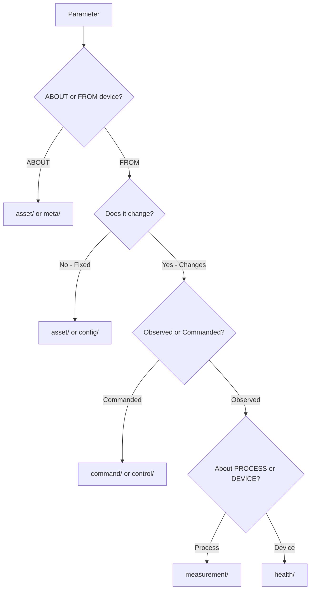
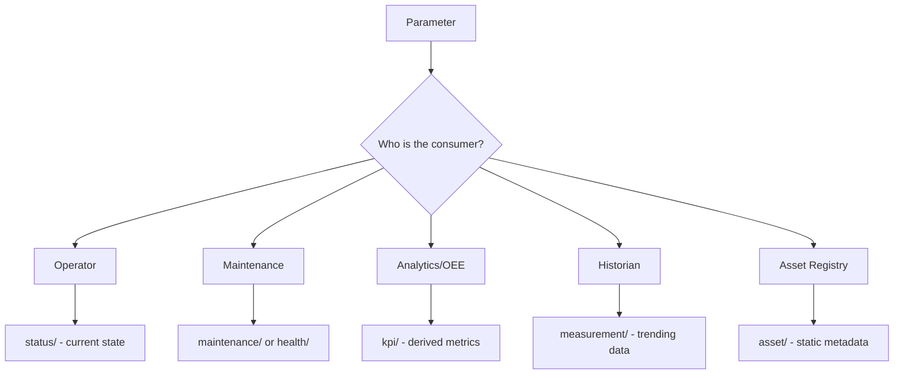
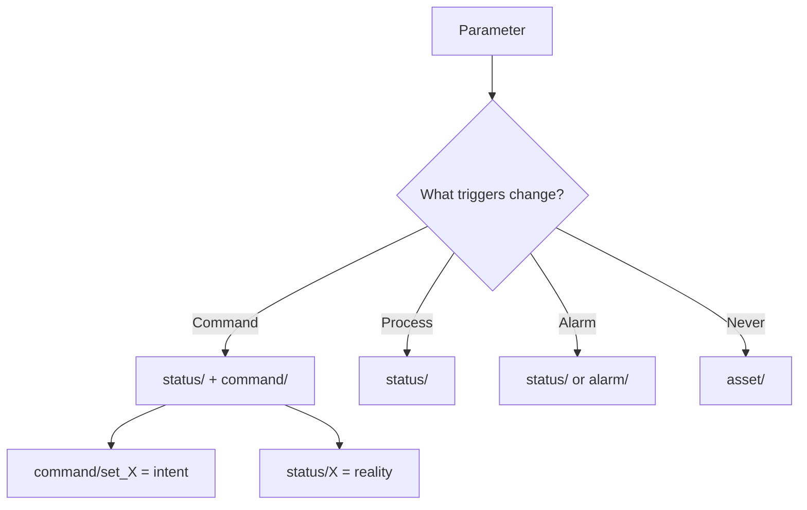

# 01. The Decision Tree (What's Actually Happening In Their Head)

## First Pass: The Nature Question `What IS this data fundamentally?`



### Example: Motor_Temperature_Deg_C

```cs
🧠 Internal dialogue:
├─ Is this ABOUT the device or FROM the device?
│  └─ FROM the device → Continue...
│
├─ Does it change, or is it fixed?
│  └─ Changes → Continue...
│
├─ Is it observed or commanded?
│  └─ Observed → measurement/ or health/
│
└─ Is it about the PROCESS or the DEVICE itself?
   ├─ Process → measurement/temperature
   └─ Device → health/winding_temperature
```

### Decision Tree JSON

```json
{
  "pass": "nature",
  "title": "What IS this data fundamentally?",
  "questions": [
    {
      "id": "q1",
      "question": "Is this ABOUT the device or FROM the device?",
      "answers": [
        { "value": "about", "next": "asset/ or meta/", "terminal": true },
        { "value": "from", "next": "q2" }
      ]
    },
    {
      "id": "q2",
      "question": "Does it change, or is it fixed?",
      "answers": [
        { "value": "fixed", "next": "asset/ or config/", "terminal": true },
        { "value": "changes", "next": "q3" }
      ]
    },
    {
      "id": "q3",
      "question": "Is it observed or commanded?",
      "answers": [
        { "value": "commanded", "next": "command/ or control/", "terminal": true },
        { "value": "observed", "next": "q4" }
      ]
    },
    {
      "id": "q4",
      "question": "Is it about the PROCESS or the DEVICE itself?",
      "answers": [
        { "value": "process", "next": "measurement/", "terminal": true },
        { "value": "device", "next": "health/", "terminal": true }
      ]
    }
  ]
}
```

**Key Insight**:
- `measurement/` → *what the device monitors* (process data)
- `health/` → *the device monitoring itself* (self-diagnostics)

---

## Second Pass: The Consumer Question `Who/what needs this data, and why?`



### Example: Total_Runtime_Hours

```cs
🧠 Thinking through use cases:
├─ Operator dashboard? → status/ (current state)
├─ Maintenance scheduling? → Could be maintenance/
├─ OEE calculation? → kpi/ (it's derived/accumulated)
├─ Historian trending? → measurement/ if it's a counter
└─ Asset registry? → asset/ if it's static metadata

Decision: It ACCUMULATES over time → kpi/runtime_hours
NOT measurement/ (not an instantaneous sensor value)
NOT asset/ (changes continuously)
```

### Decision Tree JSON

```json
{
  "pass": "consumer",
  "title": "Who/what needs this data, and why?",
  "consumers": [
    {
      "who": "operator",
      "what": "dashboard",
      "why": "Real-time visibility",
      "namespace": "status/",
      "examples": ["running", "mode", "state"]
    },
    {
      "who": "maintenance",
      "what": "scheduling",
      "why": "Predictive/preventive maintenance",
      "namespace": "maintenance/ or health/",
      "examples": ["runtime_hours", "last_service", "wear_level"]
    },
    {
      "who": "analytics",
      "what": "OEE calculation",
      "why": "Business metrics",
      "namespace": "kpi/",
      "examples": ["efficiency", "uptime_pct", "total_produced"]
    },
    {
      "who": "historian",
      "what": "trending",
      "why": "Time-series analysis",
      "namespace": "measurement/",
      "examples": ["temperature", "pressure", "flow_rate"]
    },
    {
      "who": "asset_manager",
      "what": "registry",
      "why": "Asset identification",
      "namespace": "asset/",
      "examples": ["serial_number", "model", "install_date"]
    }
  ]
}
```

**The trap to avoid**: "Runtime" *feels* like status, but it's **calculated state**, not instantaneous state.

---

## Third Pass: The Lifecycle Question `When/why does this value change?`



### Example: Operating_Mode

```cs
🧠 Change triggers:
├─ Changes due to command? → status/ (commanded mode)
├─ Changes due to process? → status/ (automatic mode)
├─ Changes due to alarm? → status/ (safe mode)
└─ Never changes (firmware)? → asset/firmware_mode

If it can be SET:
├─ command/set_mode ← The intent
└─ status/mode ← The reality

Rule: status/ is READ-ONLY from external systems
      command/ is WRITE (intent to change)
```

### Decision Tree JSON

```json
{
  "pass": "lifecycle",
  "title": "When/why does this value change?",
  "triggers": [
    {
      "trigger": "command",
      "description": "Changed by operator/system command",
      "namespaces": ["command/", "status/"],
      "pattern": {
        "intent": "command/set_{parameter}",
        "reality": "status/{parameter}"
      },
      "examples": ["set_mode", "set_speed", "start_stop"]
    },
    {
      "trigger": "process",
      "description": "Changed by process conditions",
      "namespaces": ["status/"],
      "examples": ["automatic_mode", "running_state"]
    },
    {
      "trigger": "alarm",
      "description": "Changed due to alarm condition",
      "namespaces": ["status/", "alarm/"],
      "examples": ["safe_mode", "emergency_stop"]
    },
    {
      "trigger": "never",
      "description": "Fixed at installation/commissioning",
      "namespaces": ["asset/"],
      "examples": ["firmware_version", "serial_number", "model"]
    }
  ]
}
```

**Critical distinction**: `status/mode` ≠ `command/set_mode`  
- One is *what is* (reality)
- One is *what was requested* (intent)
- The gap between them is **control loop feedback**

### Use Case Matrix

```json
[
  {
    "namespace": "measurement/",
    "example": "motor_temperature",
    "description": "Process values from sensors",
    "pass_1_nature": {
      "q1_about_or_from": "from_device",
      "q2_fixed_or_changes": "changes",
      "q3_observed_or_commanded": "observed",
      "q4_process_or_device": "process"
    },
    "pass_2_consumer": { "primary": "historian", "use_case": "trending" },
    "pass_3_lifecycle": { "trigger": "process", "writable": false },
    "final_path": "measurement/temperature"
  },
  {
    "namespace": "control/",
    "example": "target_speed_setpoint",
    "description": "Declarative setpoints - maintain this value",
    "pass_1_nature": {
      "q1_about_or_from": "to_device",
      "q2_fixed_or_changes": "changes",
      "q3_observed_or_commanded": "commanded",
      "q4_process_or_device": null
    },
    "pass_2_consumer": { "primary": "control_system", "use_case": "PID loop" },
    "pass_3_lifecycle": { "trigger": "command", "writable": true },
    "final_path": "control/target_speed"
  },
  {
    "namespace": "command/",
    "example": "start_motor",
    "description": "Imperative commands - do this now",
    "pass_1_nature": {
      "q1_about_or_from": "to_device",
      "q2_fixed_or_changes": "changes",
      "q3_observed_or_commanded": "commanded",
      "q4_process_or_device": null
    },
    "pass_2_consumer": { "primary": "operator", "use_case": "HMI buttons" },
    "pass_3_lifecycle": { "trigger": "command", "writable": true },
    "final_path": "command/start"
  },
  {
    "namespace": "status/",
    "example": "running_state",
    "description": "Current device state - read-only",
    "pass_1_nature": {
      "q1_about_or_from": "from_device",
      "q2_fixed_or_changes": "changes",
      "q3_observed_or_commanded": "observed",
      "q4_process_or_device": "device"
    },
    "pass_2_consumer": { "primary": "operator", "use_case": "dashboard" },
    "pass_3_lifecycle": { "trigger": "command_or_process", "writable": false },
    "final_path": "status/running"
  },
  {
    "namespace": "alarm/",
    "example": "high_temperature_alarm",
    "description": "Active alarms requiring action",
    "pass_1_nature": {
      "q1_about_or_from": "from_device",
      "q2_fixed_or_changes": "changes",
      "q3_observed_or_commanded": "observed",
      "q4_process_or_device": "exception"
    },
    "pass_2_consumer": { "primary": "operator", "use_case": "urgent response" },
    "pass_3_lifecycle": { "trigger": "threshold_breach", "writable": false },
    "final_path": "alarm/high_temperature"
  },
  {
    "namespace": "event/",
    "example": "batch_complete",
    "description": "Discrete occurrences - something happened",
    "pass_1_nature": {
      "q1_about_or_from": "from_device",
      "q2_fixed_or_changes": "changes",
      "q3_observed_or_commanded": "observed",
      "q4_process_or_device": "occurrence"
    },
    "pass_2_consumer": { "primary": "analytics", "use_case": "correlation" },
    "pass_3_lifecycle": { "trigger": "state_change", "writable": false },
    "final_path": "event/batch_complete"
  },
  {
    "namespace": "health/",
    "example": "winding_temperature",
    "description": "Device self-diagnostics",
    "pass_1_nature": {
      "q1_about_or_from": "from_device",
      "q2_fixed_or_changes": "changes",
      "q3_observed_or_commanded": "observed",
      "q4_process_or_device": "device"
    },
    "pass_2_consumer": { "primary": "maintenance", "use_case": "predictive" },
    "pass_3_lifecycle": { "trigger": "process", "writable": false },
    "final_path": "health/winding_temperature"
  },
  {
    "namespace": "diagnostic/",
    "example": "last_error_code",
    "description": "Troubleshooting data - not for operating",
    "pass_1_nature": {
      "q1_about_or_from": "from_device",
      "q2_fixed_or_changes": "changes",
      "q3_observed_or_commanded": "observed",
      "q4_process_or_device": "device"
    },
    "pass_2_consumer": { "primary": "engineer", "use_case": "debugging" },
    "pass_3_lifecycle": { "trigger": "error", "writable": false },
    "final_path": "diagnostic/last_error_code"
  },
  {
    "namespace": "kpi/",
    "example": "runtime_hours",
    "description": "Calculated business metrics",
    "pass_1_nature": {
      "q1_about_or_from": "from_device",
      "q2_fixed_or_changes": "changes",
      "q3_observed_or_commanded": "observed",
      "q4_process_or_device": "derived"
    },
    "pass_2_consumer": { "primary": "analytics", "use_case": "OEE" },
    "pass_3_lifecycle": { "trigger": "accumulation", "writable": false },
    "final_path": "kpi/runtime_hours"
  },
  {
    "namespace": "config/",
    "example": "alarm_threshold",
    "description": "Tunable parameters - keyboard to change",
    "pass_1_nature": {
      "q1_about_or_from": "about_device",
      "q2_fixed_or_changes": "rarely_changes",
      "q3_observed_or_commanded": "commanded",
      "q4_process_or_device": null
    },
    "pass_2_consumer": { "primary": "engineer", "use_case": "tuning" },
    "pass_3_lifecycle": { "trigger": "admin_change", "writable": true },
    "final_path": "config/alarm/high_temp_threshold"
  },
  {
    "namespace": "asset/",
    "example": "serial_number",
    "description": "Physical identity - wrench to change",
    "pass_1_nature": {
      "q1_about_or_from": "about_device",
      "q2_fixed_or_changes": "fixed",
      "q3_observed_or_commanded": null,
      "q4_process_or_device": null
    },
    "pass_2_consumer": { "primary": "asset_manager", "use_case": "registry" },
    "pass_3_lifecycle": { "trigger": "never", "writable": false },
    "final_path": "asset/serial_number"
  },
  {
    "namespace": "maintenance/",
    "example": "last_service_date",
    "description": "Service records and scheduling",
    "pass_1_nature": {
      "q1_about_or_from": "about_device",
      "q2_fixed_or_changes": "changes",
      "q3_observed_or_commanded": "observed",
      "q4_process_or_device": "device"
    },
    "pass_2_consumer": { "primary": "maintenance", "use_case": "scheduling" },
    "pass_3_lifecycle": { "trigger": "service_event", "writable": true },
    "final_path": "maintenance/last_service_date"
  },
  {
    "namespace": "recipe/",
    "example": "batch_setpoints",
    "description": "Process definitions for batch/discrete",
    "pass_1_nature": {
      "q1_about_or_from": "to_device",
      "q2_fixed_or_changes": "changes_per_product",
      "q3_observed_or_commanded": "commanded",
      "q4_process_or_device": null
    },
    "pass_2_consumer": { "primary": "production", "use_case": "batch_control" },
    "pass_3_lifecycle": { "trigger": "product_change", "writable": true },
    "final_path": "recipe/batch_setpoints"
  },
  {
    "namespace": "log/",
    "example": "operator_action_log",
    "description": "Audit trail and activity logs",
    "pass_1_nature": {
      "q1_about_or_from": "from_device",
      "q2_fixed_or_changes": "appends",
      "q3_observed_or_commanded": "observed",
      "q4_process_or_device": "audit"
    },
    "pass_2_consumer": { "primary": "compliance", "use_case": "audit_trail" },
    "pass_3_lifecycle": { "trigger": "action", "writable": false },
    "final_path": "log/operator_actions"
  },
  {
    "namespace": "history/",
    "example": "alarm_history",
    "description": "Historical records for analysis",
    "pass_1_nature": {
      "q1_about_or_from": "from_device",
      "q2_fixed_or_changes": "appends",
      "q3_observed_or_commanded": "observed",
      "q4_process_or_device": "archive"
    },
    "pass_2_consumer": { "primary": "analyst", "use_case": "post_mortem" },
    "pass_3_lifecycle": { "trigger": "event_complete", "writable": false },
    "final_path": "history/alarm"
  },
  {
    "namespace": "comm/",
    "example": "device_timestamp",
    "description": "Communication and sync metadata",
    "pass_1_nature": {
      "q1_about_or_from": "from_device",
      "q2_fixed_or_changes": "changes",
      "q3_observed_or_commanded": "observed",
      "q4_process_or_device": "infrastructure"
    },
    "pass_2_consumer": { "primary": "system", "use_case": "time_sync" },
    "pass_3_lifecycle": { "trigger": "continuous", "writable": false },
    "final_path": "comm/device_timestamp"
  },
  {
    "namespace": "security/",
    "example": "access_level",
    "description": "Authentication and authorization",
    "pass_1_nature": {
      "q1_about_or_from": "about_device",
      "q2_fixed_or_changes": "changes",
      "q3_observed_or_commanded": "both",
      "q4_process_or_device": "security"
    },
    "pass_2_consumer": { "primary": "admin", "use_case": "access_control" },
    "pass_3_lifecycle": { "trigger": "auth_event", "writable": true },
    "final_path": "security/access_level"
  },
  {
    "namespace": "meta/",
    "example": "schema_version",
    "description": "Namespace documentation",
    "pass_1_nature": {
      "q1_about_or_from": "about_namespace",
      "q2_fixed_or_changes": "rarely_changes",
      "q3_observed_or_commanded": null,
      "q4_process_or_device": null
    },
    "pass_2_consumer": { "primary": "developer", "use_case": "self_documentation" },
    "pass_3_lifecycle": { "trigger": "schema_update", "writable": true },
    "final_path": "meta/schema_version"
  }
]
```

---

## Quick Reference Matrix

| Question | Key Decision | Namespace Options |
|----------|--------------|-------------------|
| ABOUT or FROM? | Metadata vs Data | `asset/`, `meta/` vs continue |
| Fixed or Changes? | Static vs Dynamic | `asset/`, `config/` vs continue |
| Observed or Commanded? | Input vs Output | `command/`, `control/` vs continue |
| Process or Device? | What's being monitored | `measurement/` vs `health/` |
| Who needs it? | Consumer perspective | `status/`, `kpi/`, `maintenance/` |
| What triggers change? | Lifecycle | `command/`+`status/`, `asset/` |

---

## Namespace Quick Reference

| Namespace | Purpose | Data Flow | Writable | Primary Consumer | Example |
|-----------|---------|-----------|----------|------------------|---------|
| `measurement/` | Process sensor data | FROM device | ❌ No | Historian | `motor_temperature` |
| `status/` | Current device state | FROM device | ❌ No | Operator | `running_state` |
| `alarm/` | Active exceptions | FROM device | ❌ No | Operator | `high_temperature_alarm` |
| `event/` | Discrete occurrences | FROM device | ❌ No | Analytics | `batch_complete` |
| `health/` | Device self-diagnostics | FROM device | ❌ No | Maintenance | `winding_temperature` |
| `diagnostic/` | Troubleshooting data | FROM device | ❌ No | Engineer | `last_error_code` |
| `kpi/` | Calculated metrics | FROM device | ❌ No | Analytics | `runtime_hours` |
| `log/` | Audit trail | FROM device | ❌ No | Compliance | `operator_action_log` |
| `history/` | Historical archive | FROM device | ❌ No | Analyst | `alarm_history` |
| `comm/` | Communication metadata | FROM device | ❌ No | System | `device_timestamp` |
| `control/` | Declarative setpoints | TO device | ✅ Yes | Control System | `target_speed_setpoint` |
| `command/` | Imperative actions | TO device | ✅ Yes | Operator | `start_motor` |
| `recipe/` | Process definitions | TO device | ✅ Yes | Production | `batch_setpoints` |
| `asset/` | Physical identity | ABOUT device | ❌ No | Asset Manager | `serial_number` |
| `config/` | Tunable parameters | ABOUT device | ✅ Yes | Engineer | `max_temperature` |
| `maintenance/` | Service records | ABOUT device | ✅ Yes | Maintenance | `last_service_date` |
| `security/` | Access control | ABOUT device | ✅ Yes | Admin | `access_level` |
| `meta/` | Namespace docs | ABOUT namespace | ✅ Yes | Developer | `schema_version` |

---
